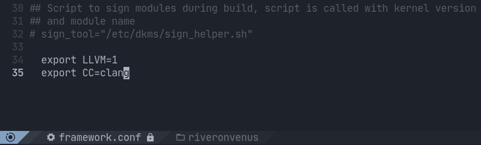

# Linux-ck-tt

The Linux-ck-tt kernel and modules with [Con Kolivas](https://github.com/ckolivas)' hrtimer patches and Task Type CPU scheduler  by [Hamad Al Marri](https://github.com/hamadmarri) and with some other patches. Built on the [Linux-ck](https://aur.archlinux.org/packages/linux-ck/) maintained by [graysky](https://github.com/graysky2).

- [Con Kolivas' hrtimer patches](https://github.com/xanmod/linux-patches/tree/master/linux-5.14.y-xanmod/ck-hrtimer) and the recommended ~~1000 Hz~~ 803 Hz tick rate. 803 Hz is the default for TT.
- [TT-CPU-Scheduler](https://github.com/hamadmarri/TT-CPU-Scheduler) - The goal of the Task Type (TT) scheduler is to detect tasks types based on their behaviours and control the schedulling based on their types.
- [kernel_compiler_patch](https://github.com/graysky2/kernel_compiler_patch) enables compiler optimizations for additional CPUs.
- [UKSM (sources)](https://github.com/dolohow/uksm) / [UKSM (info)](https://www.usenix.org/sites/default/files/conference/protected-files/fast18_slides_xia.pdf) is an improvement upon KSM. Some basic data structures and routines are borrowed from ksm.c .
- [CJKTTY](https://github.com/zhmars/cjktty-patches) supports displaying CJK Unified Ideographs on Linux tty.
- [BBR](https://github.com/google/bbr) is a congestion control algorithm proposed by Google.
- [bfq-lucjan](https://gitlab.com/sirlucjan/kernel-patches/tree/master/5.14/bfq-lucjan) is specific patches authored by Paolo Valente and Piotr Gorski.
- [clear](https://github.com/clearlinux-pkgs/linux) from Intel's Clear Linux project. Provides performance and security optimizations.

# Build and install

```
git clone https://github.com/RiverOnVenus/linux-ck-tt.git

cd linux-ck-tt/linux-ck-tt

updpkgsums && makepkg -srci
```

# Clang and DKMS

When you use a kernel compiled by CLANG/LLVM/LTO, some modules that use DKMS need to be recompiled with CLANG/LLVM. Otherwise DKMS will fail.

You need to modify the `/etc/dkms/framework.conf` file, add two lines to the end of the file: `export LLVM=1`, `export CC=clang`.



If you have done that, just reinstall or install the kernel compiled with CLANG/LLVM/LTO and DKMS will not fail again.

# Check if TT CPU Scheduler is enabled

This start-up message should appear in the kernel ring buffer when Baby in enabled, use:

```
# dmesg | grep -i 'TT CPU'
```

You can see: `TT CPU scheduler v5.14 by Hamad Al Marri.`

# Sysctl configuration improving performance

```
# See https://wiki.archlinux.org/title/Sysctl for more information.

# Networking
net.core.netdev_max_backlog = 16384
net.core.somaxconn = 8192
net.core.rmem_default = 1048576
net.core.rmem_max = 16777216
net.core.wmem_default = 1048576
net.core.wmem_max = 16777216
net.core.optmem_max = 65536
net.ipv4.tcp_rmem = 4096 1048576 2097152
net.ipv4.tcp_wmem = 4096 65536 16777216
net.ipv4.udp_rmem_min = 8192
net.ipv4.udp_wmem_min = 8192
net.ipv4.tcp_fastopen = 3
net.ipv4.tcp_max_syn_backlog = 8192
net.ipv4.tcp_max_tw_buckets = 2000000
net.ipv4.tcp_tw_reuse = 1
net.ipv4.tcp_fin_timeout = 10
net.ipv4.tcp_mtu_probing = 1
net.ipv4.tcp_syncookies = 1
net.ipv4.tcp_rfc1337 = 1
net.ipv4.tcp_keepalive_time = 120
net.ipv4.tcp_keepalive_intvl = 10
net.ipv4.tcp_keepalive_probes = 6
net.ipv4.conf.default.log_martians = 1
net.ipv4.conf.all.log_martians = 1
net.core.default_qdisc = cake

# Virtual memory
vm.vfs_cache_pressure = 50
vm.dirty_background_ratio = 5
vm.dirty_ratio = 10

# For Solid State Drives
vm.swappiness = 100
# See https://chrisdown.name/2018/01/02/in-defence-of-swap.html
```

# Changing I/O scheduler

To change the active I/O scheduler to *bfq* for device *sda*, use:

```
# echo bfq > /sys/block/sda/queue/scheduler
```

Or create file `/etc/udev/rules.d/60-ioschedulers.rules`:

```
# set scheduler for NVMe
ACTION=="add|change", KERNEL=="nvme[0-9]n[0-9]", ATTR{queue/scheduler}="bfq"
# set scheduler for SSD and eMMC
ACTION=="add|change", KERNEL=="sd[a-z]|mmcblk[0-9]*", ATTR{queue/rotational}=="0", ATTR{queue/scheduler}="bfq"
# set scheduler for rotating disks
ACTION=="add|change", KERNEL=="sd[a-z]", ATTR{queue/rotational}=="1", ATTR{queue/scheduler}="bfq"
```

**Reboot or force [udev#Loading new rules](https://wiki.archlinux.org/title/Udev#Loading_new_rules)**:

If rules fail to reload automatically, use:

```
# udevadm control --reload
```

To manually force *udev* to trigger your rules, use:

```
# udevadm trigger
```
